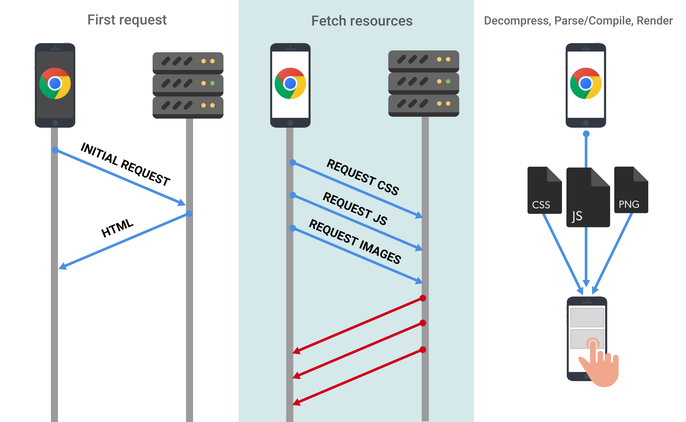

### 什么是前端性能优化

通常来讲，前端性能优化是指：从用户开始访问网站到整个页面完整地展现出来的过程中，通过各种优化策略和优化方法，让页面加载得更快，让用户的操作相应更及时，给用户更好的使用体验。

优化是在做什么：

如上图所示，优化工作是围绕前端的基本工作原理展开的，包括：**客户端和服务器端建立连接、加载资源、解析资源并渲染**。

上方图片的来源：

- [The Cost Of JavaScript](https://medium.com/dev-channel/the-cost-of-javascript-84009f51e99e)
- [[译]JavaScript 的时间消耗](https://github.com/dwqs/blog/issues/59)

### 性能优化的重要性（程序员角度）

当领导问：“**为什么网页访问这么慢**？”我们不能只是回答“**网络不好**”这么简单，网络不可能一直都不好。

每个程序员如果想要成长，就不能回避“性能优化”这个话题。很多人写了多年的代码，一直在构建样式、写业务逻辑。但是平凡的程序员之路，何时才是尽头？前端职业发展的瓶颈在哪儿？怎么才能从团队中脱颖而出？如何区分出平凡程序员/大牛程序员/架构师的分水岭？

职场晋升时，我们也要想一想：大部分人都在写业务代码，和别人相比，我的核心竞争力在哪里？除了**技术深度、前端工程化、综合素质**之外，还有其他的吗？**性能优化**，绝对是不能忽视的一方面。而且它是贯穿于开发和维护的的全过程。

前端工程化是侧重于**提效**，具体包括编译打包发布流程、物料中心、组件化等；而前端性能优化是侧重于**体验**。

公司评价一个程序员的价值，不是加班越多越好，也不是代码量越多越好，而是看他**是否能解决其他人解决不了的一些技术难题或者瓶颈**。

**大家都知道性能优化很重要，但是落实到具体，怎么去优化**？这就需要我们深入去了解前端技术背后的原理，学习一些主流的前端性能优化技术方案，掌握性能优化技术，提升 Web 性能，才能总结出相应的优化方案，而且需要多年的经验积累；进而到达前端技术圈的上游，提高自己的核心竞争力。

### 前端性能优化面试

性能优化是前端面试的必考问题，面试者在回答这个问题时，大致情况如下：

- 70% 的人上来就说减少合并资源、减少请求、数据缓存这些优化手段。

- 15% 的人会提到需要在 DevTools 下先看看首屏时间，可以先围绕首屏来做优化。

- 10%的人会提到需要接入一个性能平台来看看现状，诊断一下。

- 而只有 5% 的人会从前端性能体系来系统考虑性能优化。

面试官期待的是你在什么场景下，遇到了什么性能问题，围绕什么样的性能指标，采取了哪些性能优化手段，最后取得了什么样的结果，而不仅仅是直接说采取了哪些优化手段。

比如说，“**为什么首页打开慢**？” 面试官期待的是，前端能和后端一样，通过查日志和数据就能定位问题，而不是停留在猜测层面。但在实际当中，能做到这点的前端同学并不多。

那么，前端有没有这样的工具呢？有，那就是性能监控平台。平台上面有各个业务的性能指标及其对应场景下的性能标准，一旦遇到性能问题，就能直接判断当前性能数据有没有问题，然后提示问题是出在前端、后端，还是网络层。

### 性能优化的意义

1、随着互联网的发展，**网页的内容越来越丰富，功能越来越强大，页面也越做越漂亮**；带来的问题是，访问速度和体验会收到影响。只有对网站进行持续不断的优化，才能保证网页的访问速度可以跟得上用户体验的需求。

2、**高性能**可以带来更高的**用户参与度**、**用户留存**，进而带来更高的**转化率**和**SEO 排名**，更好的**用户体验**，最终带来更高的**业务收益**。

随着时间的推移，如果一个网站由于各种原因导致心梗越来越差，以至于用户每打开一个页面都要等待很长时间，甚至出现加载失败的情况，那么，不仅新用户不会沉淀下来，老用户也会纷纷离去，最终导致产品的加速衰败。

而且网站的加载快慢，最产品收入有着直接的影响。**有数据表明：网页加载时间在 5 秒内的网站比加载时间为 19 秒的网站，广告收入会增加近一倍**。也就是说，网站或者 App 的性能直接关系到产品的用户增长和收入增长。

正因为如此，我们才需要通过性能优化的技巧，并结合其他的技术手段来不断提高网站和 App 的用户体验，从而助力公司的业务增长；同时，我们也可以借此提升自己的技术实力，这对个人的职业成长也会以后很大的帮助。

3、只要产品上线了，随着**业务规模量和用户访问量的扩大**，性能优化就是不可回避的话题。在遇到性能问题时，有些人的解决办法是：用一些粗糙的手段把问题绕过去，但却给后面的人埋下了坑。这些人常说的依据口头禅是：`又不是不能用`

### 相关案例

- [Amazon 发现每 100ms 延迟导致 1%的销量损失](https://www.gigaspaces.com/blog/amazon-found-every-100ms-of-latency-cost-them-1-in-sales/)。

- 歌地图首页文件从 100KB 减少到 70KB，流量在第一周涨了 10%，在接下来的三周涨了 25%。

- 腾讯根据长期数据监控发现，页面一秒钟延迟会造成页面访问量下降 9.4%，跳出率增加 8.3%，转化率下降 3.5%。

### 补充

有些同学做事有拖延症，经常喜欢刷朋友圈、刷微博、看新闻，导致工作效率很低。为了解决这个问题，其实有个办法就是：把你的浏览器或者指定的软件，添加一个 5 秒的延迟，这时候，当你访问所有的网站，都会很慢。坚持一个月，你会发现，你再也不想看这些网站了，工作效率明显提升了许多。

这件事情从侧面也反映出：网站的性能如果不够好，对用户来说是一种折磨。时间一长，用户就不想用这个网站了。性能和网站的利益直接相关。涉及到：流量、搜索、转化率、用户体验。

## 如何学习性能优化

### 学习难点

我们在网上找到的文章，有很多都只是对 CSS、JS 技术本身的优化，一旦涉及到 App、后端、网络等不是很熟悉的领域，学习起来就比较困难了。结合具体业务开发的应用场景时，却不知从何下手。因此，**我们需要要由点及面，学习全链路前端性能优化的知识体系和解决方案**。

在实际工作当中，前端性能优化往往比较繁杂，学习难点主要体现在以下几个方面：todo

### 优化标准

我们在做优化时，需要有一个量化标准，比如：

- loading 要做到什么效果、动画要达到什么效果才是好的？

- 所有的事件处理，要在什么时间内完成，才能给用户良好的体验？

### 技术储备前提

- 掌握前端基础知识。

- 具备 Web 开发实战经验。

### 寻找性能瓶颈

- 了解性能指标，多快才算快。

- 利用测量工具和 API

- 优化问题，重新测量。持续迭代。

### 移动端挑战多

- 移动端的硬件不如 PC 端，且网络不稳定。

- 屏幕尺寸和交互方式都是挑战。

- 移动端用户更佳缺乏耐心。而且，很多用户是利用碎片化时间访问网页。数据参考： **>3 秒**的加载时间，导致 53%的跳出率（bounce rate）。

- 持续增长的移动端用户和电商业务。现在很多事情都是在移动端做的。

### 收获

- 由浅入深：解读优化技术内幕。

- 流行+经典：了解技术背后的设计思想。

- 了解性能优化的关键环节，升级知识储备。

- 理论+实践：掌握前端业界的流行且成熟的多种性能优化技术，脱颖而出。

- 了解大厂正在用的生产环境级别的高性能解决方案。

## 前端性能优化全过程

### 1、静态资源优化

静态资源优化包括 html、css、js、图片等资源的性能优化。包括：

- 图片的应用场景和使用

- html、css、js 的具体优化策略

- 资源文件的优化：比如文件压缩合并策略、打包方案、版本号更新方案

- 前端工程化工具等。

### 2、页面渲染架构设计及相关的技术方案选型

按照技术方案的分类，包括：

- 前后端分离技术

- SPA 单页应用

- BigPipe

- 同构直出

- PWA

- 页面加载策略

- 接口服务调优、接口缓存策略

- 大型网站背后的实际性能优化案例

- 前端组件化、模块化，加速业务开发

### 3、原生 App 优化、混合开发优化

- 浏览器的整体优化方案。比如导航条、登录态、滚动条优化等。

- 前端缓存策略和优化

- H5 静态资源请求代理的技术原理

- H5 离线技术，达到页面秒开的目标

- 混合式开发解决方案

- RN、小程序、flutter 等

### 4、服务端与网络优化

- CDN 和 DNS 优化

- 如何减少 http 请求数、减少 cookie 大小

- nginx 缓存配置和优化

- 开启和配置 gzip 压缩

- 如何开启全站 https

- 升级 Http2.0 的好处和方法

### 5、研发流程优化

- 技术调用的方法

- 前后端接口约定、加快前后端接口联调

- 前端自动化测试

- 自动化部署和上线

- 从研发的整体流程层面梳理出提升研发效率的方式和方法。

### 6、全链路质量监控体系建设

主要是对性能优化的结果进行衡量、打分、考核：

- 上线前，页面质量及时检测

- 上线后，页面性能和错误监控

- 线上运行时，页面的可用性监控

- 愿生 App 的性能和错误监控

## 前端性能优化包括哪些方面

### 1、性能优化指标与测量工具

- 行业标准

- 优化模型

- 性能测量工具：了解性能情况，并对比

- 性能相关 APIs

### 2、渲染优化

- 现代浏览器的渲染原理

- 可优化的渲染环节和方法

### 3、代码优化

- JS 优化：了解 JS 的开销、解析、优化方案，以及如何配合 V8 引擎做更有效的优化。

- html 优化

- css 优化

### 4、资源优化

- 压缩合并

- 图片格式

- 图片加载

- 字体优化

### 5、构建优化

- webpack 优化配置

- 代码拆分

- 代码压缩

- 持久化缓存

- 监测与分析

- 按需加载

### 6、传输和加载优化

- gZip

- KeepAlive

- HTTP 缓存

- Service Worker

- HTTP/2

- SSR 服务端渲染

- Nginx

### 7、更多主流优化方案

- SVG 优化图标

- FlexBox 布局

- 预加载

- 预渲染

- 窗口化提高列表性能

- 骨架屏
